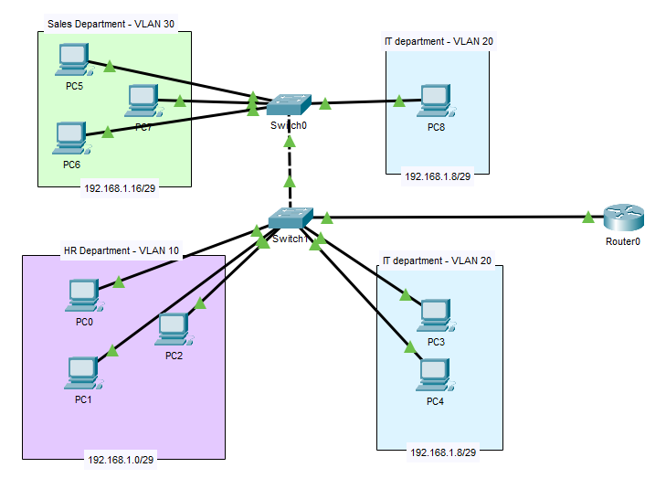

# VLAN & Subnetting Lab – Cisco Packet Tracer

This project involved the configuration of a fictional small office network using Cisco Packet tracer, focusing on VLAN segmentation, IP subnetting, and inter-VLAN routing through a router-on-a-stick setup.  

---

##  Scenario Overview

I was tasked with designing and configuring the network for a small business with three departments:

- HR
- IT
- Sales

Furthermore, the company occupies two floors of an office building. Each floor has a switch, and departments are spread as follows:

- Floor 1: HR and IT
- Floor 2: Sales and IT

---

##  Topology Overview

- 3 VLANs (HR, IT, Sales)
- 1 Router, 2 Switches, and 9 PCs
- Router-on-a-Stick used for inter-VLAN routing
- /29 subnetting applied to each VLAN

---

## Configuration Overview

Here is the subnetting and VLAN details

| VLAN   | VLAN ID | Subnet            | Gateway IP       | 
|--------|---------|-------------------|------------------|
| HR     | 10      | 192.168.1.0/29    | 192.168.1.6      | 
| IT     | 20      | 192.168.1.8/29    | 192.168.1.14     | 
| Sales  | 30      | 192.168.1.16/29   | 192.168.1.22     | 

These are the subinterfaces for the router

| Interface           | IP Address     |
|---------------------|----------------|
| GigabitEthernet0/0   | unassigned     |
| GigabitEthernet0/0.10| 192.168.0.6    |
| GigabitEthernet0/0.20| 192.168.0.14   |
| GigabitEthernet0/0.30| 192.168.0.22   |

---

##  Testing

To test the inter-VLAN connectivity, **tracert** was used to ping PC 8 to PC 1 (VLAN 20 to VLAN 10).

